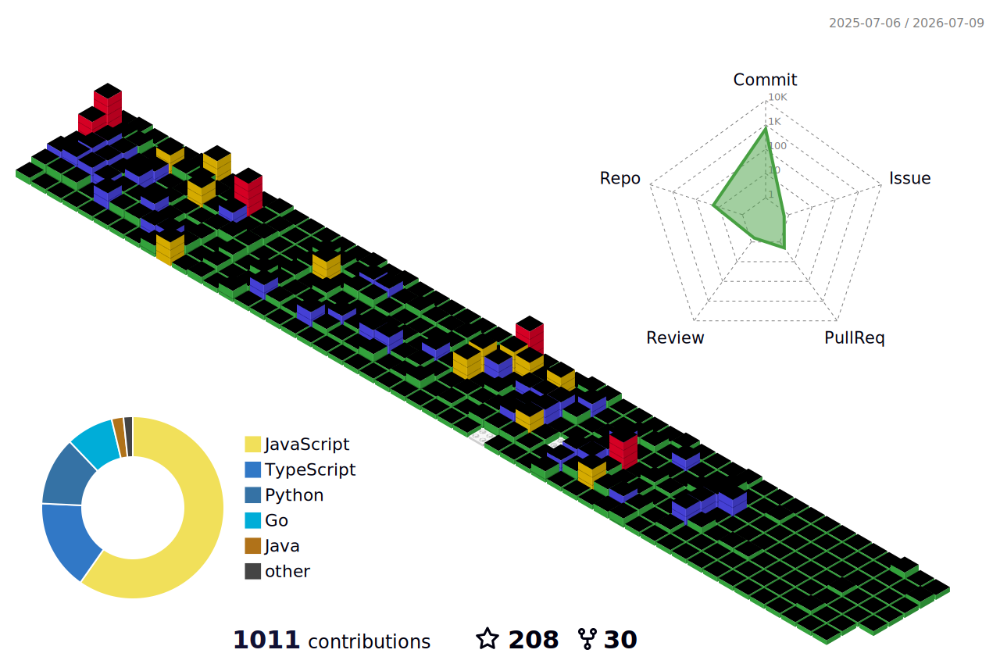

<h3>Hi there 👋,我是南秋SouthAki</h3>

最近更新的时间:2026年04月02日 05时15分（每天早上 5:00 自动更新）

Welcome to my personal homepage！

你好喵， 欢迎来访我的世界

<table style="width:100%; table-layout:fixed;">
  <tr>
    <td width="160" align="center">
      
    </td>
    <td style="padding-left: 10px; width:100%;">
      <h2>南秋SouthAki</h2>
      
循此苦旅,以达星辰

      
🌈 LGBT+ 丨 💖 单推 mldys | 🎉 热爱摄影 | ⭐ 研究数码科技 ing

    </td>
  </tr>
</table>
<table>
  <th colspan="2">
    <h3 align="left">Tools & Technology Stack:</h3>
  </th>
  <tr>
    <td>
      <h4 align="left">Technology Stack:</h4>
      

        
        
        
        
        
        
        
        
        
        
        
        
        
        
        
        
        
        
        
        
        
        
        
        
        
        
        
        
      

    </td>
    <td>
      <h4 align="left">Tools:</h4>
      

        
        
        
        
        
        
        
        
        
        
        
        
        
        
        
        
      

    </td>
  </tr>
  <tr>
    <td>
      <h4 align="left">Self Introduction:</h4>
      

        

          

          
When do you start writing code?

          - ✨ Creating bugs since 2021 (my coding journey began)

        

        

          

          
What you want to achieve

          - 🌱 I’m currently learning : Full stack development

        

        

          

            
How to contact me

             - 📫 You can: <a href="mailto:xieleihan@southaki.cn">点击给我发邮件</a>
          

        

        

          

          
What is sexual orientation?

          - 💬 Ask me about : 🌈It must be Top, not Bottom, no, don’t think I am

        

      

    </td>
    <td>
      <h4 align="left">Personal achievements:</h4>
      
    </td>
  </tr>
</table>
<!-- Github WidgetBox -->

  <h2 align="center">
  Github WidgetBox</h2>

  

<!-- Profile-3D-Contrib -->

 
<!-- Quotes 名人名言 -->
<h3 align="left">Quotes :</h3>

  

    <table>
      <tr>
        <td>
        你笑起来真像好天气。</td>
      </tr>
    </table>
     
  

<!-- Github Stats -->

  <h2 align="center">
  Github Stats</h2>

  
  

<!-- Current Streak -->

  <h2 align="center">
  Current Streak</h2>

  

