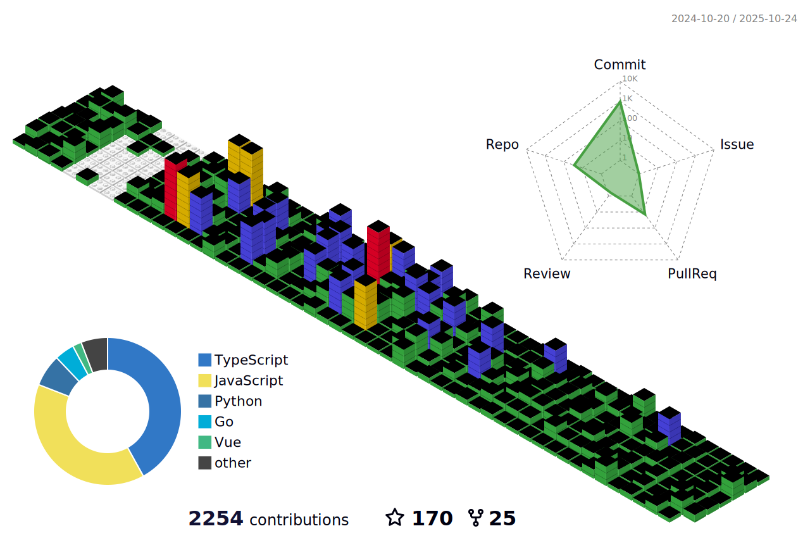

<h3>Hi there 👋,我是南秋SouthAki</h3>

今天是2025年06月10日 10时26分（每天早上 6:30 自动更新）

欢迎来到我的个人主页！

服务器信息:当前Action的IP地址是: 40.78.90.85, 位置在: 美国加利福尼亚州圣何塞 - 微软公司

你好喵， 欢迎来访我的世界

<table style="width:100%; table-layout:fixed;">
  <tr>
    <td width="160" align="center">
      
    </td>
    <td style="padding-left: 10px; width:100%;">
      <h2>南秋SouthAki</h2>
      
循此苦旅,以达星辰

      
🌈 LGBT+ 丨 💖 å•æ¨ mldys | 🉠热爱摄影 | ⭠研究数ç ç§‘技 ing

    </td>
  </tr>
</table>
<table>
  <h3 align="left">Tools & Technology Stack:</h3>
  <tr>
    <td>
      <h4 align="left">Technology Stack:</h4>
      

        
        
        
        
        
        
        
        
        
        
        
        
        
        
        
        
        
        
        
        
        
        
        
        
        
        
        
        
      

    </td>
    <td>
      <h4 align="left">Tools:</h4>
      

        
        
        
        
        
        
        
        
        
        
        
        
        
        
        
        
      

    </td>
  </tr>
  <tr>
    <td>
      <h4 align="left">Self Introduction:</h4>
      

        
- ✨ Creating bugs since 2021 (my coding journey began)

        
- 🌱 I’m currently learning : Full stack development

        
- 📫 How to reach me: <a href="https://mail.google.com">xieleihan@southaki.cn</a>

        
- 💬 Ask me about : 🌈It must be Top, not Bottom, no, don’t think I am

      

    </td>
    <td>
      
    </td>
  </tr>
</table>
<!-- Github WidgetBox -->

  <h2 align="center">
  Github WidgetBox</h2>

  

<!-- Profile-3D-Contrib -->

 
<!-- Quotes 名人名言 -->
<h3 align="left">Quotes :</h3>

 

<!-- Github Stats -->

  <h2 align="center">
  Github Stats</h2>

  
  

<!-- Current Streak -->

  <h2 align="center">
  Current Streak</h2>

  

